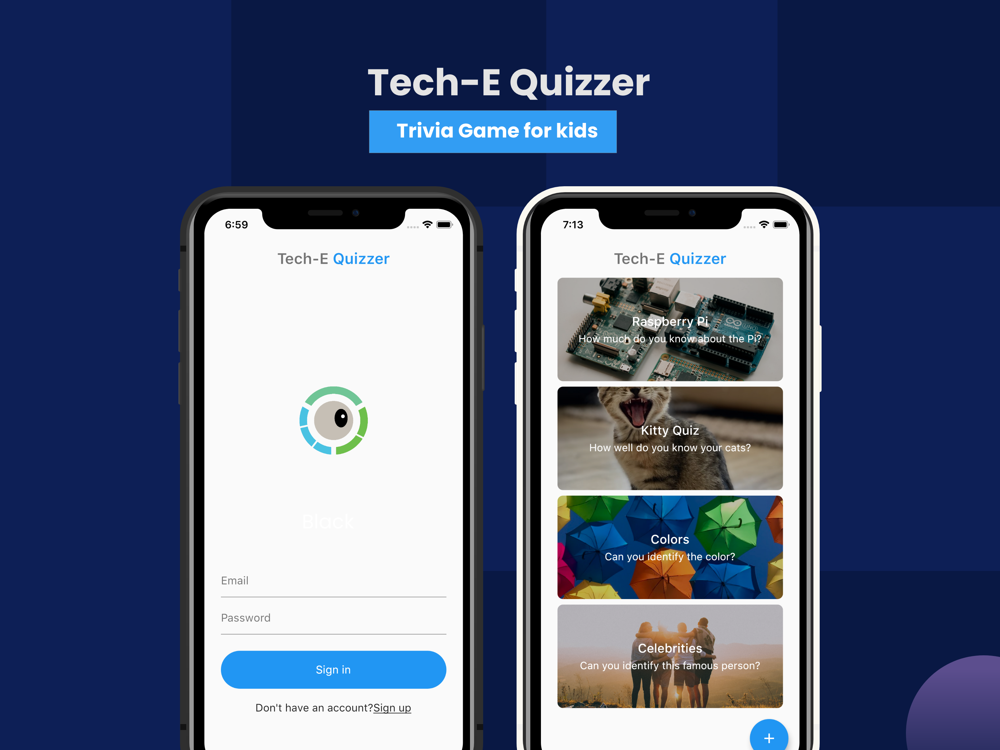

<h1 align="center">
   
  </a>
   
  QuizR
   
</h1>
<h4 align="center">A simple Flutter app for users to create quizzes and test their knowledge.</h4>

  <a href="#key-features">Key Features</a> •
  <a href="#credits">Credits</a> •

## Key Features

* Authentication via Google Firebase - Users can sign in with email/password or create new accounts.
* Custom Quizzes (TODO) - Users can create their own quizzes to test others on.
* Image Upload via Google FireStore- Users can upload custom images for their quizzes.
* Real Time Update - App updates real time to reflect answered questions, correct, and incorrect.

## Credits

This software uses the following open source packages:

- [Firebase](https://firebase.google.com/)
