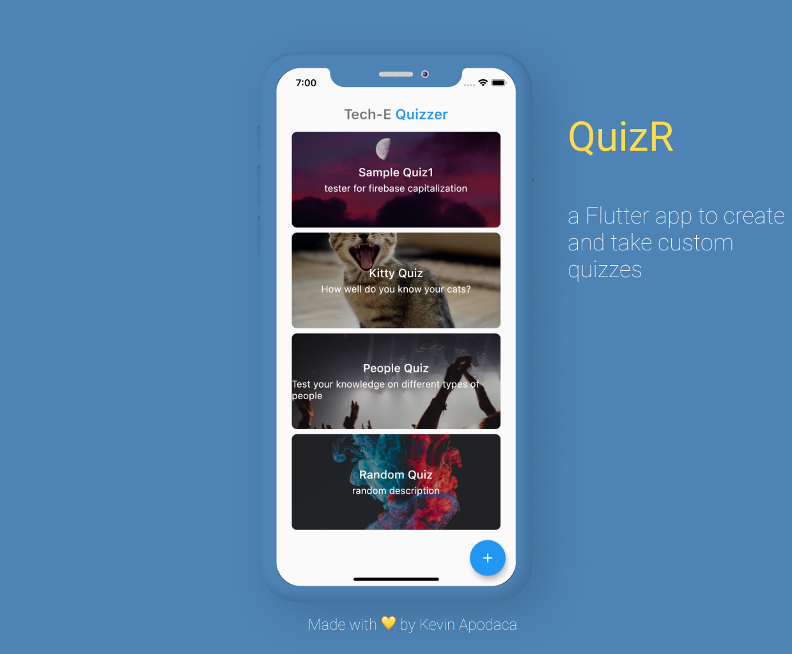

<h1 align="center"> QuizR </h1>  

  

 A simple Flutter app for users to create quizzes and test their knowledge

## Showcase

  

## Features

* Authentication via Google Firebase - Users can sign in with email/password or create new accounts.
* Custom Quizzes - Users can create their own quizzes to test others on.
* Image Upload via Google FireStore- Users can upload custom images for their quizzes.
* Real Time Update - App updates real time to reflect answered questions, correct, and incorrect.
